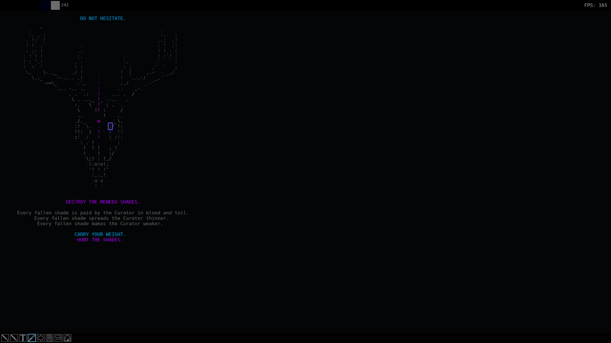

# The Imago v0.4

- By Lauren Hollesen
- Made with LÖVE 11.5

## About

The Imago is an application designed for the game [Aetolia, the Midnight Age](https://www.aetolia.com/), by [Iron Realms Entertainment](https://www.ironrealms.com/).

It can be used as a text editor and drawing tool to better facilitate the use of color writing in Aetolia. Simply draw/type naturally on the canvas, apply color, and the Imago will take care of formatting for you, including the use of color codes and more!

As of now this application is in an early state but should be functional enough for simple color writing projects.

Please feel free to report any issues either on this Github repo or in-game via message!

## Installation Instructions

The Imago is a portable application and does not need an installer.

- Download and unzip `Imago.zip` using your archival application of choice.
- Run `Imago.exe` from within the `The_Imago` directory.
- Usage instructions will appear every time you run the application!

